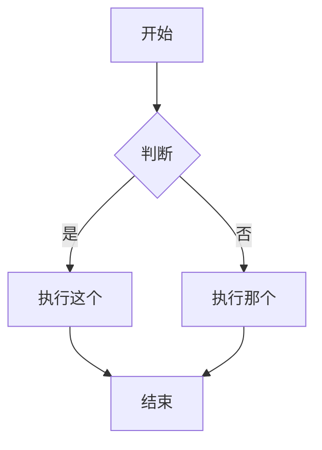

# Obsidian Flavored Markdown 语法指南

本指南详细介绍了 Obsidian 支持的 Markdown 语法，包括标准 Markdown 以及 Obsidian 特有的扩展语法（如双向链接、Callouts、嵌入等）。

## 基本格式 (Basic Formatting)

### 段落与换行

```markdown
这是一个段落。

这是另一个段落（中间的空行将它们分开）。

如果要在段落内换行，请在行尾添加两个空格  
或者使用 Shift+Enter。
```

### 标题

```markdown
# 一级标题
## 二级标题
### 三级标题
#### 四级标题
##### 五级标题
###### 六级标题
```

### 文本样式

| 样式 | 语法 | 示例 | 输出 |
|-------|--------|---------|--------|
| 粗体 | `**文本**` 或 `__文本__` | `**粗体**` | **粗体** |
| 斜体 | `*文本*` 或 `_文本_` | `*斜体*` | *斜体* |
| 粗斜体 | `***文本***` | `***粗斜体***` | ***粗斜体*** |
| 删除线 | `~~文本~~` | `~~删除线~~` | ~~删除线~~ |
| 高亮 | `==文本==` | `==高亮==` | ==高亮== |
| 行内代码 | `` `代码` `` | `` `代码` `` | `代码` |

### 转义字符

使用反斜杠来转义特殊字符，使其显示为普通文本：
```markdown
\*这里不会变成斜体\*
\#这里不会变成标题
1\. 这里不会变成列表项
```

常用转义字符: `\*`, `\_`, `\#`, `` \` ``, `\|`, `\~`

## 内部链接 / 双向链接 (Wikilinks)

### 基本链接

```markdown
[[笔记名称]]
[[笔记名称.md]]
[[笔记名称|显示文本]]
```

### 链接到标题

```markdown
[[笔记名称#标题]]
[[笔记名称#标题|自定义显示文本]]
[[#当前笔记内的标题]]
[[##搜索库中所有标题]]
```

### 链接到块 (Block Links)

```markdown
[[笔记名称#^block-id]]
[[笔记名称#^block-id|自定义显示文本]]
```

你可以通过在段落末尾添加 `^block-id` 来定义块 ID：
```markdown
这是一个可以被链接的段落。 ^my-block-id
```

对于列表和引用，块 ID 需要单独占一行：
```markdown
> 这是一个引用
> 包含多行内容

^quote-id
```

## Markdown 标准链接

```markdown
[显示文本](笔记名称.md)
[显示文本](笔记名称.md#标题)
[显示文本](https://example.com)
[笔记](obsidian://open?vault=VaultName&file=Note.md)
```

注意：Markdown 链接中的空格必须编码为 `%20`。

## 嵌入 (Embeds)

### 嵌入笔记

```markdown
![[笔记名称]]
![[笔记名称#标题]]
![[笔记名称#^block-id]]
```

### 嵌入图片

```markdown
![[image.png]]
![[image.png|640x480]]    宽度 x 高度
![[image.png|300]]        仅设置宽度 (保持比例)
```

### 外部图片

```markdown


```

### 嵌入音频

```markdown
![[audio.mp3]]
![[audio.ogg]]
```

### 嵌入 PDF

```markdown
![[document.pdf]]
![[document.pdf#page=3]]
![[document.pdf#height=400]]
```

### 嵌入搜索结果

````markdown
```query
tag:#project status:done
```
````

## 提示块 (Callouts)

### 基本 Callout

```markdown
> [!note]
> 这是一个笔记类型的 callout。

> [!info] 自定义标题
> 这个 callout 有自定义标题。

> [!tip] 仅有标题
```

### 可折叠 Callout

```markdown
> [!faq]- 默认折叠
> 内容初始是隐藏的，点击展开。

> [!faq]+ 默认展开
> 内容初始是可见的，可以折叠。
```

### 嵌套 Callout

```markdown
> [!question] 外层 Callout
> > [!note] 内层 Callout
> > 嵌套内容
```

### 支持的 Callout 类型

| 类型 | 别名 | 描述 |
|------|---------|-------------|
| `note` | - | 蓝色，铅笔图标 |
| `abstract` | `summary`, `tldr` | 青色，剪贴板图标 |
| `info` | - | 蓝色，信息图标 |
| `todo` | - | 蓝色，复选框图标 |
| `tip` | `hint`, `important` | 青色，火焰图标 |
| `success` | `check`, `done` | 绿色，对勾图标 |
| `question` | `help`, `faq` | 黄色，问号图标 |
| `warning` | `caution`, `attention` | 橙色，警告图标 |
| `failure` | `fail`, `missing` | 红色，叉号图标 |
| `danger` | `error` | 红色，闪电图标 |
| `bug` | - | 红色，虫子图标 |
| `example` | - | 紫色，列表图标 |
| `quote` | `cite` | 灰色，引用图标 |

## 列表 (Lists)

### 无序列表

```markdown
- 项目 1
- 项目 2
  - 嵌套项目
  - 另一个嵌套项目
- 项目 3

* 也可以使用星号
+ 或者加号
```

### 有序列表

```markdown
1. 第一项
2. 第二项
   1. 嵌套编号
   2. 另一个嵌套
3. 第三项

1) 另一种语法
2) 使用括号
```

### 任务列表

```markdown
- [ ] 未完成任务
- [x] 已完成任务
- [ ] 包含子任务的任务
  - [ ] 子任务 1
  - [x] 子任务 2
```

## 引用 (Quotes)

```markdown
> 这是一个块引用。
> 可以跨越多行。
> 
> 并且包含多个段落。
> 
> > 嵌套引用也是支持的。
```

## 代码 (Code)

### 行内代码

```markdown
使用 `反引号` 包裹行内代码。
如果代码中包含反引号，请使用 ``双反引号 ` ``。
```

### 代码块

````markdown
```
普通代码块
```

```javascript
// 语法高亮代码块
function hello() {
  console.log("Hello, world!");
}
```

```python
# Python 示例
def greet(name):
    print(f"Hello, {name}!")
```
````

## 表格 (Tables)

```markdown
| 标题 1 | 标题 2 | 标题 3 |
|----------|----------|----------|
| 单元格 1   | 单元格 2   | 单元格 3   |
| 单元格 4   | 单元格 5   | 单元格 6   |
```

### 对齐方式

```markdown
| 左对齐     | 居中   | 右对齐    |
|:---------|:--------:|---------:|
| Left     | Center   | Right    |
```

### 在表格中使用竖线

使用反斜杠转义竖线：
```markdown
| 列 1 | 列 2 |
|----------|----------|
| [[Link\|显示文本]] | ![[Image\|100]] |
```

## 数学公式 (LaTeX)

### 行内公式

```markdown
这是行内公式：$e^{i\pi} + 1 = 0$
```

### 块级公式

```markdown
$$
\begin{vmatrix}
a & b \\
c & d
\end{vmatrix} = ad - bc
$$
```

## 图表 (Mermaid)

````markdown

````

## 脚注 (Footnotes)

```markdown
这句话有一个脚注[^1]。

[^1]: 这是脚注的内容。

也可以使用命名脚注[^note]。

[^note]: 命名脚注在显示时仍然是数字。

支持行内脚注。^[这是行内脚注内容。]
```

## 注释 (Comments)

```markdown
这是可见的 %%但是这是隐藏的%% 文本。

%%
整个块都是隐藏的。
在阅读视图中不会显示。
%%
```

## 水平分割线

```markdown
---
***
___
- - -
```

## 属性 / Frontmatter

属性使用笔记开头的 YAML Frontmatter 区域：

```yaml
---
title: 我的笔记标题
date: 2024-01-15
tags:
  - 项目
  - 重要
alias:
  - 别名1
  - 别名2
cssclasses:
  - custom-class
status: 进行中
rating: 4.5
completed: false
due: 2024-02-01T14:30:00
---
```

## 标签 (Tags)

```markdown
#标签
#嵌套/标签
#带-连字符的标签
#带_下划线的标签

在 Frontmatter 中：
---
tags:
  - 标签1
  - 嵌套/标签2
---
```

## HTML 内容

Obsidian 支持在 Markdown 中嵌入 HTML：

```markdown
<div class="custom-container">
  <span style="color: red;">彩色文本</span>
</div>

<details>
  <summary>点击展开</summary>
  这里是隐藏内容。
</details>

<kbd>Ctrl</kbd> + <kbd>C</kbd>
```